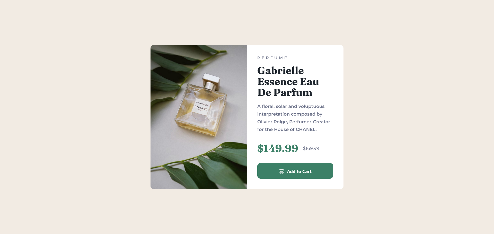

# Frontend Mentor - Product preview card component solution

This is a solution to the [Product preview card component challenge on Frontend Mentor](https://www.frontendmentor.io/challenges/product-preview-card-component-GO7UmttRfa). 

### Screenshot

###  Active Screenshot

### Links

- Solution URL: [Solution URL here](https://www.frontendmentor.io/solutions/product-preview-card-component-_Y-NURSCaE)
- Live Site URL: [Live site URL here](https://tuhin-jr.github.io/Product-preview-card-component/)

## My process

### Built with

- Semantic HTML5 markup
- CSS custom properties
- Flexbox

## Author

- Frontend Mentor - [@Tuhin-jr](https://www.frontendmentor.io/profile/Tuhin-jr)

## Acknowledgments

This is where you can give a hat tip to anyone who helped you out on this project. Perhaps you worked in a team or got some inspiration from someone else's solution. This is the perfect place to give them some credit.

**Note: Delete this note and edit this section's content as necessary. If you completed this challenge by yourself, feel free to delete this section entirely.**
